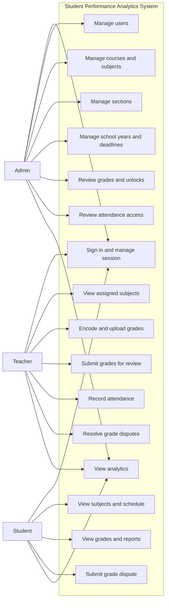
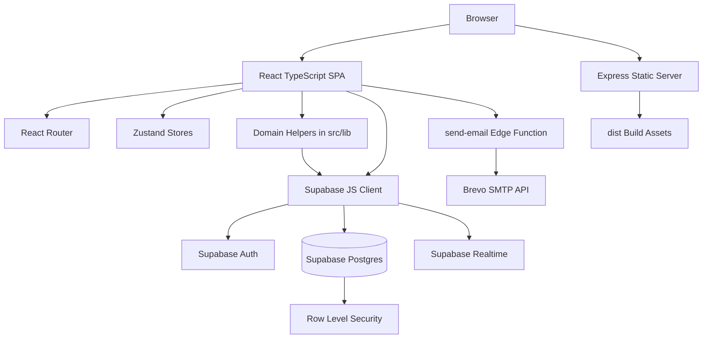
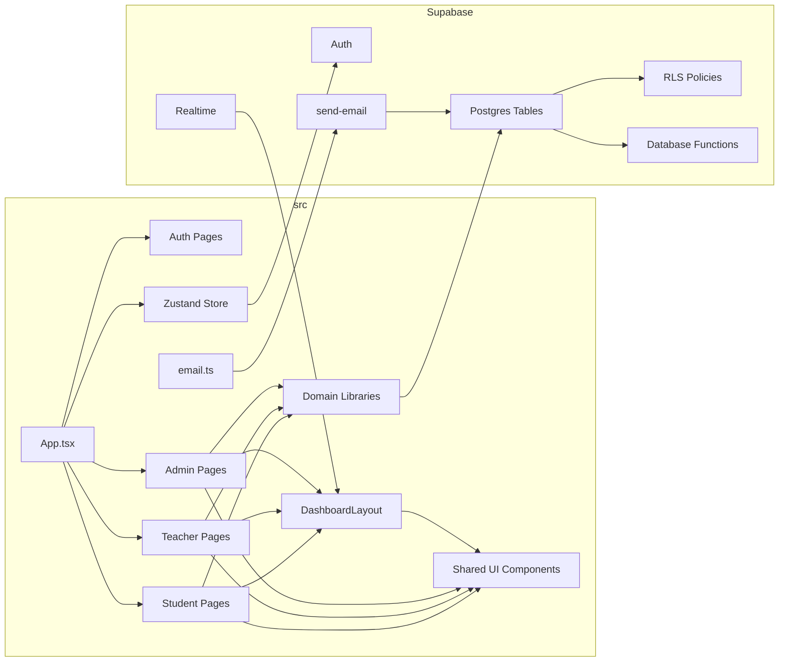
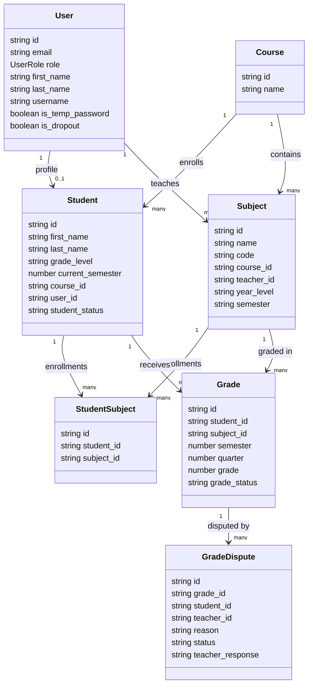
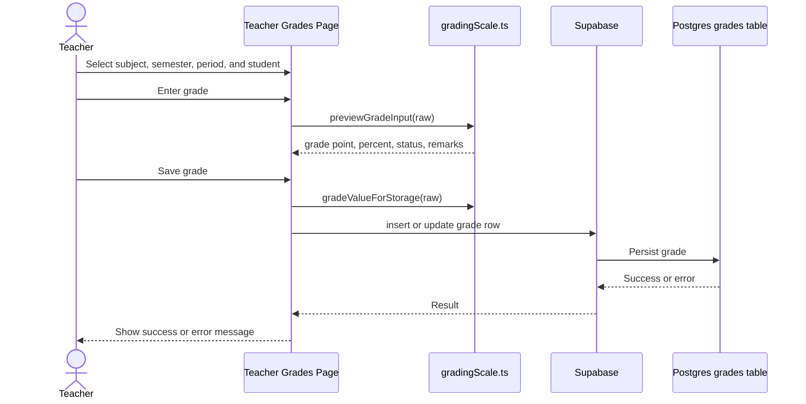
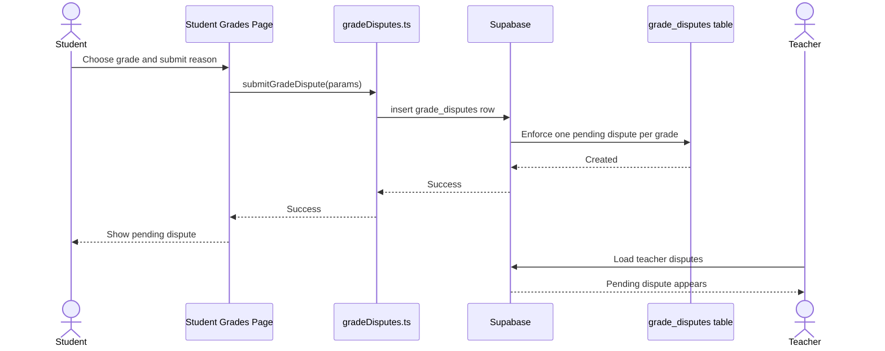
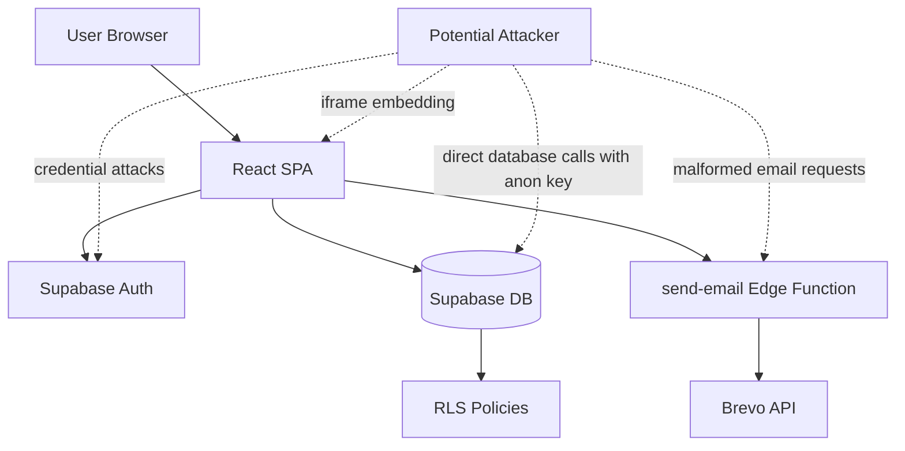

# Software Engineering II Documentation

Project: Student Performance Analytics System (SAPAS)
Branding: Edulytics PHILTECH
Repository package: `student-performance-analytics`
System type: Role-based academic management and analytics web application

This document follows the Software Engineering II format provided by the user.
It organizes SAPAS documentation by grading period: Prelim, Midterm,
Semifinals, and Finals.

---

## PRELIM

Coverage: Requirements + Architecture + Planning

This phase focuses on planning and designing the system before coding.

---

## 1. Requirements Engineering (Advanced)

### 1.1 System overview

SAPAS is a web-based system for managing student academic performance. It
supports administrators, teachers, and students in handling users, courses,
subjects, sections, grade encoding, attendance, school years, academic
advancement, grade disputes, and analytics.

The system uses:

- React, TypeScript, and Vite for the frontend.
- Supabase Auth for authentication.
- Supabase Postgres for data storage.
- Supabase Row Level Security for data protection.
- Supabase Realtime for live refresh and notifications.
- Supabase Edge Functions and Brevo for email delivery.
- Express for production static serving.

### 1.2 Stakeholders

| Stakeholder | Interest in the system |
| --- | --- |
| School administrator | Manages users, courses, sections, subjects, school years, grade approvals, attendance access, and reports |
| Teacher | Encodes grades, records attendance, views students, submits grades, and resolves grade disputes |
| Student | Views subjects, schedules, grades, reports, analytics, and submits grade disputes |
| Registrar or academic office | Needs accurate student records, sections, year levels, and academic standing |
| System maintainer | Maintains codebase, database migrations, deployment, and security controls |

### 1.3 Functional requirements

#### Authentication and account management

| ID | Requirement |
| --- | --- |
| FR-AUTH-001 | The system shall allow users to sign in through Supabase Auth. |
| FR-AUTH-002 | The system shall redirect users to dashboards based on role. |
| FR-AUTH-003 | The system shall require temporary-password users to change passwords. |
| FR-AUTH-004 | The system shall support forgot-password and reset-password flows. |
| FR-AUTH-005 | The system shall lock accounts after repeated failed login attempts. |
| FR-AUTH-006 | The system shall block login for dropout student accounts. |
| FR-AUTH-007 | The system shall log users out after inactivity. |
| FR-AUTH-008 | The system shall synchronize logout across browser tabs. |

#### Admin functions

| ID | Requirement |
| --- | --- |
| FR-ADM-001 | Admins shall manage admin, teacher, and student accounts. |
| FR-ADM-002 | Admins shall create generated student IDs using course and year-level rules. |
| FR-ADM-003 | Admins shall manage courses. |
| FR-ADM-004 | Admins shall manage subjects, subject codes, teachers, year levels, semesters, and class days. |
| FR-ADM-005 | Admins shall manage official sections and student section assignments. |
| FR-ADM-006 | Admins shall manage school years and set the active school year. |
| FR-ADM-007 | Admins shall publish system announcements. |
| FR-ADM-008 | Admins shall configure grading period deadlines. |
| FR-ADM-009 | Admins shall review submitted grades. |
| FR-ADM-010 | Admins shall approve, reopen, or unlock grade rows. |
| FR-ADM-011 | Admins shall approve or reject teacher attendance access requests. |
| FR-ADM-012 | Admins shall advance eligible students to the next semester. |
| FR-ADM-013 | Admins shall promote eligible students to the next year level. |
| FR-ADM-014 | Admins shall view administrative analytics. |

#### Teacher functions

| ID | Requirement |
| --- | --- |
| FR-TCH-001 | Teachers shall view subjects assigned to them. |
| FR-TCH-002 | Teachers shall view students enrolled in assigned subjects. |
| FR-TCH-003 | Teachers shall encode grades by student, subject, semester, and grading period. |
| FR-TCH-004 | Teachers shall preview official grade point equivalents before saving grades. |
| FR-TCH-005 | Teachers shall upload bulk grades from spreadsheets. |
| FR-TCH-006 | Teachers shall submit grades for admin review. |
| FR-TCH-007 | Teachers shall request grade unlocks when correction is needed. |
| FR-TCH-008 | Teachers shall record attendance as present, late, or absent. |
| FR-TCH-009 | Teachers shall mark subject dates as class or no class. |
| FR-TCH-010 | Teachers shall request attendance access for off-schedule or locked dates. |
| FR-TCH-011 | Teachers shall review and resolve student grade disputes. |
| FR-TCH-012 | Teachers shall view teacher-level analytics. |

#### Student functions

| ID | Requirement |
| --- | --- |
| FR-STU-001 | Students shall view their enrolled subjects. |
| FR-STU-002 | Students shall view their class schedule. |
| FR-STU-003 | Students shall view grades by school year, semester, and grading period. |
| FR-STU-004 | Students shall view an official grade report. |
| FR-STU-005 | Students shall print grade report views. |
| FR-STU-006 | Students shall submit grade disputes. |
| FR-STU-007 | Students shall view dispute resolution notifications. |
| FR-STU-008 | Students shall view academic standing guidance, back subjects, and prerequisite-related information. |
| FR-STU-009 | Students shall view personal analytics and performance trends. |

#### Academic workflow functions

| ID | Requirement |
| --- | --- |
| FR-ACAD-001 | The system shall associate grade rows with the active school year. |
| FR-ACAD-002 | The system shall support first and second semester workflows. |
| FR-ACAD-003 | The system shall support four grading periods: prelims, midterms, semi-finals, and finals. |
| FR-ACAD-004 | The system shall enforce subject-semester grade consistency. |
| FR-ACAD-005 | The system shall support prerequisite rules. |
| FR-ACAD-006 | The system shall identify visible, hidden, past-term, and back-subject enrollments. |
| FR-ACAD-007 | The system shall block advancement when academic rules are not met. |
| FR-ACAD-008 | The system shall preserve relevant historical enrollments and grade history. |

### 1.4 Non-functional requirements

| ID | Category | Requirement |
| --- | --- | --- |
| NFR-001 | Usability | The interface shall provide role-specific navigation and clear dashboards. |
| NFR-002 | Security | The system shall use authentication and role-aware route protection. |
| NFR-003 | Security | Database access shall be controlled by Supabase RLS policies. |
| NFR-004 | Security | The app shall set anti-clickjacking headers. |
| NFR-005 | Reliability | The app shall handle missing migrations or unavailable optional data gracefully where supported. |
| NFR-006 | Maintainability | Domain logic shall be centralized in shared helper modules. |
| NFR-007 | Maintainability | Schema changes shall be tracked in SQL migrations. |
| NFR-008 | Performance | The production build shall split large vendor bundles into manual chunks. |
| NFR-009 | Compatibility | The app shall support direct route refresh through SPA fallback. |
| NFR-010 | Auditability | Academic workflow state shall be stored in database columns such as `workflow_status`, lock fields, and dispute timestamps. |
| NFR-011 | Availability | Production hosting shall serve static files through Express or an equivalent static host with fallback. |
| NFR-012 | Privacy | User profile persistence shall avoid storing password hashes in the app state. |

### 1.5 Use cases

| Use case ID | Use case | Primary actor | Summary |
| --- | --- | --- | --- |
| UC-001 | Sign in | Admin, Teacher, Student | User signs in and is redirected to the correct dashboard. |
| UC-002 | Manage users | Admin | Admin creates, updates, locks, or removes user accounts. |
| UC-003 | Manage subjects | Admin | Admin creates subjects, assigns teachers, sets semester/year level, and sets schedules. |
| UC-004 | Manage sections | Admin | Admin creates sections and assigns students. |
| UC-005 | Configure academic year | Admin | Admin creates and activates school years and announcements. |
| UC-006 | Configure grade deadlines | Admin | Admin sets period deadlines that lock teacher grade entry. |
| UC-007 | Encode grades | Teacher | Teacher creates or updates grades for enrolled students. |
| UC-008 | Upload bulk grades | Teacher | Teacher imports spreadsheet grade records after preview validation. |
| UC-009 | Submit grades for review | Teacher | Teacher sends grade rows to admin for approval. |
| UC-010 | Review grades | Admin | Admin approves, reopens, or unlocks submitted grade rows. |
| UC-011 | Record attendance | Teacher | Teacher marks present, late, or absent records for class dates. |
| UC-012 | Request attendance access | Teacher | Teacher asks admin for permission to edit an off-schedule or locked date. |
| UC-013 | Review attendance access | Admin | Admin approves or rejects attendance access requests. |
| UC-014 | View grades | Student | Student views grades and official report details. |
| UC-015 | Submit grade dispute | Student | Student disputes an existing grade row. |
| UC-016 | Resolve grade dispute | Teacher | Teacher accepts or rejects a student dispute. |
| UC-017 | View analytics | Admin, Teacher, Student | User views role-specific academic analytics. |
| UC-018 | Advance or promote students | Admin | Admin advances semester or year level based on academic rules. |

### 1.6 Use case diagram



### 1.7 User stories

#### Admin user stories

| ID | User story | Acceptance criteria |
| --- | --- | --- |
| US-ADM-001 | As an admin, I want to create user accounts so that teachers and students can access the system. | Admin can create accounts, assign roles, and see them in the user list. |
| US-ADM-002 | As an admin, I want generated student IDs so that student usernames follow school rules. | Student IDs follow `STUD-{COURSE}-{YEAR}{SEQUENCE}`. |
| US-ADM-003 | As an admin, I want to manage courses and subjects so that the academic catalog is accurate. | Admin can create, update, and assign subjects to courses and teachers. |
| US-ADM-004 | As an admin, I want to set the active school year so that grades are scoped correctly. | Only one school year is active. |
| US-ADM-005 | As an admin, I want to configure grading deadlines so that grade entry closes after official deadlines. | Teachers cannot encode grades after a closed deadline. |
| US-ADM-006 | As an admin, I want to review grade submissions so that official records are verified. | Submitted grade rows can be approved or reopened. |
| US-ADM-007 | As an admin, I want to review attendance access requests so that locked attendance records remain controlled. | Pending requests can be approved or rejected. |
| US-ADM-008 | As an admin, I want to promote students so that year levels and sections remain current. | Promotion updates student and user year-level fields and enrollment rows. |

#### Teacher user stories

| ID | User story | Acceptance criteria |
| --- | --- | --- |
| US-TCH-001 | As a teacher, I want to view my assigned subjects so that I can manage only my classes. | Teacher subject list is filtered by teacher ID. |
| US-TCH-002 | As a teacher, I want to encode grades so that student performance records are updated. | Grade rows save with student, subject, semester, period, and status. |
| US-TCH-003 | As a teacher, I want grade previews so that I know the official equivalent before saving. | The system displays grade point, remarks, and status from the grade scale. |
| US-TCH-004 | As a teacher, I want to upload spreadsheets so that bulk grade entry is faster. | Invalid spreadsheet rows are reported before saving. |
| US-TCH-005 | As a teacher, I want to submit grades for review so that admins can approve them. | Submitted rows change workflow status to review state. |
| US-TCH-006 | As a teacher, I want to record attendance so that class participation is tracked. | Attendance records store present, late, or absent scores. |
| US-TCH-007 | As a teacher, I want to request access to locked attendance dates so that corrections are controlled. | Request appears for admin review. |
| US-TCH-008 | As a teacher, I want to resolve grade disputes so that student concerns are handled. | Dispute status changes to accepted or rejected with a response. |

#### Student user stories

| ID | User story | Acceptance criteria |
| --- | --- | --- |
| US-STU-001 | As a student, I want to view my subjects so that I know my enrolled classes. | Student sees visible current, past-term, and back subjects. |
| US-STU-002 | As a student, I want to view my schedule so that I know class days. | Schedule page displays subject class-day information. |
| US-STU-003 | As a student, I want to view grades by period so that I can monitor performance. | Grades can be filtered by school year, semester, subject, and period. |
| US-STU-004 | As a student, I want an official grade report so that I can print or review formal records. | Report rows and GPA are generated from grade data. |
| US-STU-005 | As a student, I want to dispute a grade so that possible errors can be reviewed. | A pending dispute is created if none exists for that grade. |
| US-STU-006 | As a student, I want resolution notifications so that I know the result of my dispute. | Resolved disputes appear as notifications until acknowledged. |
| US-STU-007 | As a student, I want analytics so that I can understand strengths and weaknesses. | Analytics page shows trends and suggestions when grade data is available. |

### 1.8 Product backlog

| Priority | Backlog item | Related requirements |
| --- | --- | --- |
| High | Authentication and role dashboards | FR-AUTH-001 to FR-AUTH-008 |
| High | User management | FR-ADM-001, FR-ADM-002 |
| High | Course and subject management | FR-ADM-003, FR-ADM-004 |
| High | Student enrollment and section management | FR-ADM-005, FR-ACAD-006 |
| High | Teacher grade encoding | FR-TCH-003, FR-ACAD-003 |
| High | Student grade viewing | FR-STU-003, FR-STU-004 |
| High | Supabase database schema and RLS | NFR-002, NFR-003 |
| Medium | Grade workflow approval and unlocks | FR-ADM-009, FR-ADM-010, FR-TCH-006, FR-TCH-007 |
| Medium | Grading period deadlines | FR-ADM-008, FR-ACAD-001 |
| Medium | Attendance recording | FR-TCH-008, FR-TCH-009 |
| Medium | Attendance access requests | FR-TCH-010, FR-ADM-011 |
| Medium | Grade disputes | FR-STU-006, FR-TCH-011 |
| Medium | Academic advancement and prerequisites | FR-ADM-012, FR-ADM-013, FR-ACAD-005, FR-ACAD-007 |
| Medium | Analytics dashboards | FR-ADM-014, FR-TCH-012, FR-STU-009 |
| Low | Onboarding tour | NFR-001 |
| Low | Expanded CI and automated tests | NFR-006, NFR-007 |

### 1.9 Requirements validation

Validation methods:

- Review role dashboards against stakeholder needs.
- Trace every route to at least one functional requirement.
- Verify database migrations support required tables and columns.
- Run manual smoke tests for admin, teacher, and student workflows.
- Run TypeScript checks after code changes.
- Confirm route protection and RLS policies before production deployment.
- Confirm email templates and edge function secrets for account and reset flows.

### 1.10 Requirements traceability

| Requirement | Implementation location |
| --- | --- |
| FR-AUTH-001 to FR-AUTH-008 | `src/App.tsx`, `src/pages/auth/`, `src/lib/supabase.ts`, `src/store/index.ts`, `src/lib/loginLock.ts` |
| FR-ADM-001 to FR-ADM-014 | `src/pages/admin/`, `src/components/layouts/DashboardLayout.tsx` |
| FR-TCH-001 to FR-TCH-012 | `src/pages/teacher/`, `src/lib/bulkGradeUploadPreview.ts`, `src/lib/attendance.ts` |
| FR-STU-001 to FR-STU-009 | `src/pages/student/`, `src/components/student/`, `src/lib/officialGradeReport.ts` |
| FR-ACAD-001 to FR-ACAD-008 | `src/lib/studentAcademicRules.ts`, `src/lib/subjectSemester.ts`, `supabase/migrations/` |
| NFR-002 to NFR-004 | Supabase RLS migrations, `server.js`, `vite.config.ts`, `vercel.json`, `public/_headers` |
| NFR-006 to NFR-007 | `src/lib/`, `src/types/index.ts`, `supabase/migrations/` |
| NFR-008 to NFR-009 | `vite.config.ts`, `server.js` |

### 1.11 Managing changing requirements

The system supports changing requirements through:

- SQL migrations for database evolution.
- Shared TypeScript types for model changes.
- Centralized domain helpers for grading, attendance, and academic rules.
- Role-based route grouping for feature additions.
- Pull request review before merging.
- Documentation updates when environment, routes, schemas, or workflows change.

Deliverables:

- Software Requirements: Provided in sections 1.1 to 1.11.
- Use Case Diagram: Provided in section 1.6.
- User Stories: Provided in section 1.7.
- Product Backlog: Provided in section 1.8.

---

## 2. Software Architecture and Design

### 2.1 Architectural style

SAPAS uses a client-server architecture.

```text
React SPA client <-> Supabase backend services
React SPA client <-> Supabase Edge Function <-> Brevo API
Production browser <-> Express static server <-> dist assets
```

The frontend follows a layered organization:

| Layer | Location | Responsibility |
| --- | --- | --- |
| Presentation | `src/pages`, `src/components` | Route pages, layouts, tables, modals, dashboards |
| State | `src/store`, component state | Auth state, data state, UI state, local form state |
| Domain logic | `src/lib` | Grade scale, attendance, academic rules, reports, formatting |
| API access | `src/lib/supabase.ts`, `src/api/email.ts` | Supabase client and edge function calls |
| Data and policy | `supabase/migrations` | Tables, policies, triggers, functions |

MVC is partially represented in the frontend:

- Model: Supabase tables and TypeScript types.
- View: React components and pages.
- Controller: Page-level handlers and shared library functions.

The system is not implemented as microservices. It uses a single SPA with
managed backend services from Supabase.

### 2.2 System decomposition

Major subsystems:

1. Authentication and session subsystem.
2. Admin management subsystem.
3. Teacher grade and attendance subsystem.
4. Student viewing and dispute subsystem.
5. Academic workflow subsystem.
6. Analytics subsystem.
7. Notification and Realtime subsystem.
8. Email subsystem.
9. Deployment and static serving subsystem.

### 2.3 Architecture diagram



### 2.4 Component diagram



### 2.5 Component responsibilities

| Component | Responsibility |
| --- | --- |
| `src/App.tsx` | Defines routes, auth hydration, protected routes, inactivity timeout, cross-tab logout |
| `DashboardLayout.tsx` | Role navigation, notifications, announcements, onboarding tour shell |
| `src/pages/admin` | Admin management screens |
| `src/pages/teacher` | Teacher subject, grade, attendance, dispute, and analytics screens |
| `src/pages/student` | Student subject, schedule, grade, report, dispute, and analytics screens |
| `src/components/ui` | Shared cards, modals, tables, inputs, buttons, loaders, badges |
| `src/store/index.ts` | Auth, data, and UI Zustand stores |
| `src/lib/gradingScale.ts` | Official grade conversion, display, pass/fail, and GWA helpers |
| `src/lib/studentAcademicRules.ts` | Back-subject, prerequisite, and visibility rules |
| `src/lib/attendance.ts` | Attendance scores, labels, summaries, and period scores |
| `src/lib/gradeDisputes.ts` | Grade dispute queries, status helpers, notifications |
| `src/api/email.ts` | Email template generation and Edge Function calls |
| `supabase/migrations` | Tables, indexes, policies, triggers, and functions |
| `supabase/functions/send-email` | Email delivery through Brevo |

### 2.6 Architectural trade-offs

| Decision | Benefit | Trade-off |
| --- | --- | --- |
| React SPA | Fast role-based UI and client-side routing | Requires SPA fallback on hosting |
| Supabase backend | Faster development with Auth, database, RLS, Realtime | Requires careful policy review and migration management |
| Domain logic in `src/lib` | Reusable rules across pages | Some rules must also be mirrored in SQL functions |
| Direct Supabase calls from pages | Simple data flow and fewer custom server endpoints | Large pages can accumulate query and state logic |
| Checked-in `dist/` | Can serve prebuilt output | Build artifacts can create noisy diffs |
| Edge Function for email | Keeps email API key out of browser | Requires separate function deployment and secrets |

### 2.7 SOLID and separation of concerns

Applied principles:

- Single Responsibility: grade conversion, attendance scoring, academic rules,
  and disputes live in separate helper modules.
- Open/Closed: new role pages and helpers can be added without changing core
  app bootstrapping.
- Interface Segregation: shared TypeScript types define focused entities such
  as `User`, `Student`, `Subject`, `Grade`, and `GradeDispute`.
- Dependency Inversion: React pages depend on helper functions and Supabase
  client abstractions instead of raw browser APIs for most domain behavior.
- Separation of Concerns: UI components, page workflows, domain rules, data
  access, database migrations, and deployment config are separated by folder.

### 2.8 Design justification document

SAPAS prioritizes rapid academic workflow development, role-specific usability,
and managed backend services. Supabase is appropriate because the system needs
authentication, relational data, database functions, row-level security,
Realtime updates, and edge functions without maintaining a custom backend.

React and Vite are appropriate because the UI is dashboard-heavy and route
driven. TypeScript helps reduce errors in shared data models and academic rules.
Tailwind supports fast and consistent styling across many role screens.

The current architecture is best suited for a school-level academic management
system where a single application manages multiple workflows. If requirements
grow toward multi-school tenancy, strict audit logging, or complex reporting,
the system could evolve by adding a dedicated backend API layer and stricter
database policies.

Deliverables:

- Architecture Diagram: Provided in section 2.3.
- Component Diagram: Provided in section 2.4.
- Design Justification Document: Provided in section 2.8.

---

## 3. Software Project Management (Planning Phase)

### 3.1 Process model

Recommended process: Agile with lightweight documentation.

Rationale:

- Requirements can change as school workflows are clarified.
- Features can be delivered by role and workflow.
- Database migrations allow incremental schema changes.
- Pull requests allow review before merging.

Waterfall is less suitable because grade, attendance, and academic advancement
rules may change after stakeholder review. A hybrid model is possible by using
the grading-period deliverables as milestones while implementing features
iteratively.

### 3.2 Scrum roles

| Scrum role | Project equivalent |
| --- | --- |
| Product owner | School representative or academic workflow owner |
| Scrum master | Team lead or project coordinator |
| Developers | Frontend, database, QA, and documentation contributors |
| Stakeholders | Admin office, teachers, students, registrar |

### 3.3 Scrum ceremonies

| Ceremony | Purpose |
| --- | --- |
| Sprint planning | Select role workflows or backlog items to implement next |
| Daily standup | Identify progress, blockers, and integration issues |
| Sprint review | Demonstrate completed workflows to stakeholders |
| Sprint retrospective | Identify improvements in process and code quality |
| Backlog refinement | Update requirements, acceptance criteria, and priorities |

### 3.4 Estimation techniques

Recommended techniques:

- Story points for backlog items.
- Planning poker for team estimation.
- Complexity labels for technical risk.
- Spike tasks for unclear database or academic rule behavior.

Example complexity categories:

| Complexity | Description |
| --- | --- |
| Low | UI-only or documentation change with no schema impact |
| Medium | Page workflow change using existing schema and helpers |
| High | Cross-role workflow, schema migration, RLS, and Realtime impact |

### 3.5 Sprint roadmap

This roadmap is phase-based instead of calendar-based.

| Phase | Main goal | Example backlog items |
| --- | --- | --- |
| Sprint 1 | Establish foundation | Auth, roles, layout, Supabase client, base schema |
| Sprint 2 | Admin catalog | Users, courses, subjects, sections |
| Sprint 3 | Grade workflow | Teacher encoding, student grade view, admin review |
| Sprint 4 | Attendance workflow | Attendance sessions, records, access requests |
| Sprint 5 | Academic rules | School years, prerequisites, semester advancement, promotion |
| Sprint 6 | Disputes and analytics | Grade disputes, role notifications, dashboards |
| Sprint 7 | Hardening | Security review, documentation, testing, deployment readiness |

### 3.6 Risk matrix

| Risk | Likelihood | Impact | Mitigation |
| --- | --- | --- | --- |
| RLS policies are too permissive or too restrictive | Medium | High | Review policies with role-based test accounts before deployment |
| Academic rules change after implementation | High | Medium | Keep rules centralized in helpers and migrations |
| Grade calculations differ between UI and database | Medium | High | Maintain shared documented grade scale and test sample records |
| Missing Supabase migrations in deployment | Medium | High | Add deployment checklist and migration verification |
| Email secrets missing | Medium | Medium | Document required Edge Function secrets and smoke test email |
| Large page components become hard to maintain | Medium | Medium | Extract domain rules and reusable UI components |
| No automated test runner configured | Medium | Medium | Add targeted test framework in future enhancement plan |
| Spreadsheet formats vary | High | Medium | Keep preview validation strict and show row-level errors |
| Direct route refresh fails on static hosting | Medium | Medium | Use Express fallback or equivalent rewrite rules |

### 3.7 Initial schedule

The initial schedule follows the grading-period structure:

| Grading period | Focus | Main output |
| --- | --- | --- |
| Prelim | Requirements, architecture, and planning | System blueprint |
| Midterm | Object-oriented design and collaboration setup | Structured codebase |
| Semifinals | Testing, security, and QA | Stable and secure system |
| Finals | Metrics, maintenance, and final integration | Production-ready system |

Deliverables:

- Project Plan: Provided in sections 3.1 to 3.7.
- Sprint Plan: Provided in section 3.5.
- Risk Matrix: Provided in section 3.6.
- Initial Schedule: Provided in section 3.7.

---

## MIDTERM

Coverage: Advanced Design + Implementation Foundations

This phase focuses on object-oriented design and collaboration setup.

---

## 4. Advanced Object-Oriented Design

### 4.1 Design pattern usage

Although SAPAS is a React functional application rather than a traditional
class-based OOP application, several design patterns are still visible.

| Pattern | Location or example | Purpose |
| --- | --- | --- |
| Singleton | `src/lib/supabase.ts` exports one shared Supabase client | Keeps one configured backend client for app data access |
| Factory | `createStudentUsernameAllocator()` in `src/lib/supabase.ts` | Creates a reusable username allocation function with internal sequence state |
| Adapter | `sapasAuthStorage` in `src/lib/supabase.ts` | Adapts browser storage to Supabase `SupportedStorage` |
| Strategy | Grade parsing and display helpers in `gradingScale.ts` | Handles percentage input and grade-point input through shared conversion rules |
| Observer | Supabase Realtime subscriptions and storage event listeners | Reacts to database or browser-session changes |
| Decorator-like UI composition | `DashboardLayout` wraps role pages | Adds navigation, notifications, and onboarding around page content |

### 4.2 Class diagram

The implementation uses TypeScript interfaces rather than runtime classes for
domain entities.



### 4.3 Sequence diagram: teacher encodes grade



### 4.4 Sequence diagram: student submits grade dispute



### 4.5 Refactoring opportunities

Current maintainability opportunities:

| Area | Issue | Suggested refactor |
| --- | --- | --- |
| Large role pages | Some pages contain extensive state, queries, and UI rendering | Extract custom hooks and smaller presentational components |
| Repeated Supabase query patterns | Similar joins appear in multiple pages | Create typed data access helpers |
| Type errors in existing source | Typecheck currently reports unrelated app-source errors | Resolve strict TypeScript errors and add CI check |
| Grade and academic rule parity | Some rules exist in both frontend helpers and SQL functions | Add test cases with shared examples for both layers |
| Spreadsheet upload | Preview and save flows are complex | Split parsing, validation, preview UI, and persistence |

### 4.6 Refactored code sample examples

Existing examples of extracted logic:

- `src/lib/gradingScale.ts` extracts grade conversion from pages.
- `src/lib/attendanceAccess.ts` extracts attendance edit permission rules.
- `src/lib/studentAcademicRules.ts` extracts back-subject and prerequisite logic.
- `src/lib/bulkGradeUploadPreview.ts` extracts spreadsheet preview logic.
- `src/lib/officialGradeReport.ts` extracts report generation logic.

Deliverables:

- Class Diagram: Provided in section 4.2.
- Sequence Diagrams: Provided in sections 4.3 and 4.4.
- Pattern Implementation: Provided in section 4.1.
- Refactored Code Samples: Identified in section 4.6.

---

## 5. Version Control and Collaboration

### 5.1 Git workflow

Recommended Git workflow:

1. Start from `main`.
2. Create a feature branch.
3. Commit each logical change.
4. Push the branch.
5. Open a draft pull request.
6. Run checks and manual smoke tests.
7. Request review.
8. Merge after approval.

Example branch naming:

```text
cursor/add-project-documentation-5e66
feature/teacher-grade-upload
fix/student-grade-report-filter
docs/software-engineering-documentation
```

### 5.2 Branching and merging

Recommended branch types:

| Branch type | Purpose |
| --- | --- |
| `main` | Stable base branch |
| `feature/*` | New functionality |
| `fix/*` | Bug fixes |
| `docs/*` | Documentation-only changes |
| `chore/*` | Maintenance and tooling |

Merging should happen through pull requests so code and docs can be reviewed.

### 5.3 Pull request checklist

Before merging a pull request:

- Confirm the branch is based on the latest `main`.
- Confirm requirements or issue context is clear.
- Review changed files for scope control.
- Run `npm run typecheck` when source files change.
- Run `npm run build` for production-sensitive changes.
- Test affected admin, teacher, and student workflows manually.
- Check Supabase migrations if schema changed.
- Update documentation if routes, env vars, schemas, or workflows changed.

### 5.4 Code review focus

Reviewers should check:

- Role access and route protection.
- RLS and database policy impact.
- Grade scale correctness.
- Academic advancement and prerequisite correctness.
- Attendance locking and access request behavior.
- Error handling and user-facing messages.
- Type safety.
- Reuse of shared helpers.
- Documentation updates.

### 5.5 Continuous integration

No CI configuration is currently present in the repository. Recommended CI
checks:

```bash
npm ci
npm run typecheck
npm run build
```

Optional future checks:

- Unit tests when a test runner is added.
- Linting.
- Markdown link checks.
- Supabase migration linting.
- Dependency audit reports.

Deliverables:

- Git repository: Current repository.
- Feature branches: Recommended in section 5.1.
- Pull request reviews: Recommended in sections 5.3 and 5.4.
- CI setup: Recommended in section 5.5.

---

## SEMIFINALS

Coverage: Testing, Security and Quality

This phase focuses on building a high-quality, secure, testable system.

---

## 6. Software Testing and Quality Assurance

### 6.1 Current testing status

The repository currently has:

- TypeScript checking through `npm run typecheck`.
- Production build checking through `npm run build`.
- Manual role-based smoke testing.
- No configured automated unit, integration, or end-to-end test runner.

During documentation validation, `npm run typecheck` was blocked by existing
TypeScript errors in application source files unrelated to documentation. These
should be resolved before using typecheck as a reliable merge gate.

### 6.2 Test plan

| Test level | Goal | Example scope |
| --- | --- | --- |
| Unit testing | Verify helper functions in isolation | Grade scale, attendance access, academic rules |
| Integration testing | Verify interaction between pages, helpers, and Supabase | Grade save, dispute submit, attendance request |
| System testing | Verify complete role workflows | Admin review, teacher grade encoding, student grade viewing |
| Acceptance testing | Verify stakeholder expectations | School-year setup, official report, promotion rules |
| Regression testing | Prevent repeated defects | Grade conversion, RLS-sensitive queries, deadlines |

### 6.3 Recommended automated test targets

| Module | Test examples |
| --- | --- |
| `gradingScale.ts` | Percentage to grade point, pass/fail, GWA snapping, INC handling |
| `attendance.ts` | Present/late/absent scores, summaries, no-class exclusions |
| `attendanceAccess.ts` | Off-schedule, locked, approved, pending, rejected access states |
| `studentAcademicRules.ts` | Back subjects, future semester hidden subjects, prerequisites |
| `bulkGradeUploadPreview.ts` | Spreadsheet row validation and existing-grade matching |
| `officialGradeReport.ts` | Report rows and semester GPA |
| `gradeDisputes.ts` | Status labels, notification generation, duplicate pending dispute handling |

### 6.4 Manual test cases

#### Authentication

| Test ID | Steps | Expected result |
| --- | --- | --- |
| TC-AUTH-001 | Sign in as admin | User lands on `/admin/dashboard` |
| TC-AUTH-002 | Sign in as teacher | User lands on `/teacher/dashboard` |
| TC-AUTH-003 | Sign in as student | User lands on `/student/dashboard` |
| TC-AUTH-004 | Access another role route | User is redirected to own role dashboard |
| TC-AUTH-005 | Stay inactive until timeout | User is warned and then logged out |
| TC-AUTH-006 | Log out in one tab | Other tabs are logged out |

#### Admin

| Test ID | Steps | Expected result |
| --- | --- | --- |
| TC-ADM-001 | Create a course | Course appears in course list |
| TC-ADM-002 | Create a subject and assign teacher | Teacher sees subject under My Subjects |
| TC-ADM-003 | Create a student | Student account and profile are created |
| TC-ADM-004 | Activate a school year | Only selected year is active |
| TC-ADM-005 | Set grading deadline in the past | Teacher grade entry for that period is blocked |
| TC-ADM-006 | Approve submitted grades | Grade rows become approved or locked as designed |
| TC-ADM-007 | Approve attendance access | Teacher can edit the requested date |

#### Teacher

| Test ID | Steps | Expected result |
| --- | --- | --- |
| TC-TCH-001 | Open My Subjects | Assigned subjects load |
| TC-TCH-002 | Encode percentage grade | Official grade point preview appears and row saves |
| TC-TCH-003 | Encode grade-point grade | Value snaps to official scale and row saves |
| TC-TCH-004 | Mark grade as INC | Grade row status becomes `inc` |
| TC-TCH-005 | Upload spreadsheet with invalid rows | Preview reports row errors |
| TC-TCH-006 | Submit grades for review | Admin workflow alert appears |
| TC-TCH-007 | Record attendance on scheduled date | Attendance records save |
| TC-TCH-008 | Request access for blocked date | Admin sees pending request |
| TC-TCH-009 | Accept grade dispute | Linked grade is updated and dispute is resolved |

#### Student

| Test ID | Steps | Expected result |
| --- | --- | --- |
| TC-STU-001 | Open My Subjects | Visible subjects load |
| TC-STU-002 | Open Schedule | Class-day data appears |
| TC-STU-003 | Open My Grades | Grades and report rows load |
| TC-STU-004 | Filter grades by school year | Only matching grade rows appear |
| TC-STU-005 | Submit grade dispute | Pending dispute appears and duplicate pending dispute is blocked |
| TC-STU-006 | Teacher resolves dispute | Student receives resolution notification |
| TC-STU-007 | Open Analytics | Student performance insights appear when data exists |

### 6.5 Bug report log template

| Bug ID | Summary | Steps to reproduce | Expected | Actual | Severity | Status |
| --- | --- | --- | --- | --- | --- | --- |
| BUG-001 | Example: typecheck fails | Run `npm run typecheck` | No TypeScript errors | Existing source errors are reported | Medium | Open |

### 6.6 Coverage report plan

Because no automated test runner is configured, coverage is not currently
available. Recommended future setup:

- Add Vitest for unit tests.
- Add React Testing Library for component tests.
- Add Playwright for end-to-end tests.
- Generate coverage reports from unit and component tests.

Deliverables:

- Test Plan: Provided in sections 6.2 and 6.3.
- Test Cases: Provided in section 6.4.
- Unit Test Implementation: Recommended targets in section 6.3.
- Coverage Report: Planned in section 6.6.
- Bug Report Log: Template in section 6.5.

---

## 7. Security and Reliability Basics

### 7.1 Security checklist

| Area | Control |
| --- | --- |
| Authentication | Supabase Auth sessions are used |
| Route protection | Role-based `ProtectedRoute` prevents wrong-role page access |
| Database protection | Supabase RLS policies are expected for data access |
| Secrets | Supabase URL and anon key use Vite env vars; Brevo key is Edge Function secret |
| Email | Browser calls Edge Function, not Brevo directly |
| Session timeout | 30-minute inactivity timeout |
| Cross-tab logout | Storage events synchronize logout |
| Login lockout | Failed login tracking and lock time fields are supported |
| Dropout accounts | Dropout student login can be blocked |
| Clickjacking | Frame protection headers in Vite, Express, Vercel, and static headers |
| Password storage | Password hashes are stripped from client auth store state |

### 7.2 Threat model



### 7.3 Threats and mitigations

| Threat | Risk | Mitigation |
| --- | --- | --- |
| Unauthorized route access | User attempts to access another role page | Protected routes redirect based on role |
| Unauthorized data access | User calls Supabase directly | RLS policies must enforce data ownership and role access |
| Credential brute force | Repeated failed login attempts | Login lockout fields and functions |
| Dropout account access | Dropped student logs in | `is_dropout` account block |
| Clickjacking | App embedded in malicious iframe | `X-Frame-Options` and CSP `frame-ancestors` |
| Email API key exposure | Browser sends email directly through Brevo | Brevo key stored only as Edge Function secret |
| Stale session use | User leaves session open | Inactivity timeout and logout |
| Grade tampering | Teacher edits after deadline or approval | Deadline locks, workflow status, unlock requests, admin review |
| Attendance tampering | Teacher edits locked/off-schedule date | Attendance access request workflow |

### 7.4 Exception handling strategy

Current strategy:

- Supabase errors are caught in page handlers.
- User-facing failures appear through message modals or inline states.
- Optional missing migration cases are sometimes handled by falling back to
  empty data.
- Edge Function returns JSON errors with HTTP status codes.

Recommended improvements:

- Add a centralized error logger.
- Normalize Supabase error messages for user display.
- Track critical workflow failures in a bug log.
- Add boundary components for unexpected React rendering errors.

### 7.5 Logging implementation

Current logging:

- Browser console logging for selected errors.
- Edge Function logs Brevo and function errors with `console.error`.
- Supabase stores data changes in tables but does not yet provide a complete
  audit log for every user action.

Recommended logging:

- Add audit rows for grade approvals, unlocks, attendance access reviews, and
  account status changes.
- Capture Edge Function failures in a monitoring tool.
- Add production-safe client error reporting.

### 7.6 Reliability controls

| Reliability concern | Current or recommended control |
| --- | --- |
| Direct route refresh | Express SPA fallback |
| Missing email config | Edge Function returns explicit 503 errors |
| Inactive sessions | Automatic timeout |
| Realtime disconnect | Pages can still reload data manually |
| Database schema drift | SQL migrations in repository |
| Grade deadline enforcement | Database function and UI checks |
| Attendance date control | Schedule and access request rules |

Deliverables:

- Security Checklist: Provided in section 7.1.
- Threat Model Diagram: Provided in section 7.2.
- Logging Implementation: Provided in section 7.5.
- Error Handling Strategy: Provided in section 7.4.

---

## FINALS

Coverage: Metrics, Maintenance and Evolution + Final Integration

This phase focuses on evaluating the system and preparing it for real-world
sustainability.

---

## 8. Software Metrics and Measurement

### 8.1 Code quality metrics

Recommended metrics:

| Metric | Purpose | Current source |
| --- | --- | --- |
| TypeScript error count | Measures type safety | `npm run typecheck` |
| Production build success | Measures deploy readiness | `npm run build` |
| Bundle size | Measures frontend payload | Vite build output |
| Vulnerability count | Measures dependency risk | `npm audit` |
| Migration count | Measures database evolution | `supabase/migrations` |
| Large component count | Measures maintainability risk | Manual review or static analysis |
| Test coverage | Measures automated verification | Future test runner |

### 8.2 Current technical observations

| Observation | Impact |
| --- | --- |
| The repository contains 34 Supabase migrations | Database behavior is feature-rich but requires careful deployment discipline |
| The app has no automated test runner | Manual testing is currently important |
| Typecheck currently reports existing source errors | Type safety gate should be repaired before strict CI enforcement |
| `dist/` is checked in | Production assets can be served directly but build diffs require review |
| Domain logic is mostly centralized in `src/lib` | Good maintainability foundation |
| Large page components exist | Future refactoring can improve readability and testability |

### 8.3 Maintainability index plan

Recommended maintainability review:

1. Identify largest TSX files by line count.
2. Identify pages with repeated Supabase query logic.
3. Extract reusable data hooks.
4. Add unit tests for extracted domain helpers.
5. Track typecheck errors until the count reaches zero.
6. Add CI checks after typecheck and build are stable.

### 8.4 Cyclomatic complexity plan

Recommended targets for complexity review:

- `src/pages/admin/Users.tsx`
- `src/pages/teacher/Grades.tsx`
- `src/pages/teacher/Attendance.tsx`
- `src/pages/student/Grades.tsx`
- `src/lib/studentAcademicRules.ts`
- `src/lib/bulkGradeUploadPreview.ts`

Complex handlers should be split into smaller pure functions or custom hooks.

### 8.5 Productivity metrics

Useful project productivity indicators:

- Number of completed backlog items per phase.
- Number of reviewed pull requests.
- Number of resolved bugs.
- Number of passing smoke test cases.
- Number of documented workflows.
- Number of database migrations successfully applied to staging.

### 8.6 Defect density plan

Track defects by subsystem:

- Authentication.
- Admin catalog.
- Grade workflow.
- Attendance workflow.
- Academic advancement.
- Grade disputes.
- Analytics.
- Deployment.

Defect density can be approximated as:

```text
defect density = confirmed defects / subsystem size
```

Subsystem size can be estimated by source file count, line count, or story
point count.

Deliverables:

- Metrics Report: Provided in sections 8.1 to 8.6.
- Code Quality Analysis: Provided in sections 8.2 to 8.4.
- Technical Evaluation: Provided in section 8.7.

### 8.7 Technical evaluation

SAPAS has a strong feature base for school academic operations. Its main
strengths are role-specific workflows, Supabase-backed persistence, documented
migrations, centralized domain helpers, and broad coverage of grades,
attendance, sections, academic rules, disputes, and analytics.

The primary technical risks are typecheck failures in existing source files,
lack of automated tests, large page components, and the need to review RLS
policies before production use. These risks can be reduced by repairing
typecheck, adding tests for domain helpers, extracting page logic into hooks,
and formalizing CI.

---

## 9. Software Maintenance and Evolution

### 9.1 Technical debt log

| ID | Technical debt | Impact | Recommended action |
| --- | --- | --- | --- |
| TD-001 | TypeScript errors in existing app source | Blocks typecheck as a reliable quality gate | Fix errors and add typecheck to CI |
| TD-002 | No automated test runner | Regression risk | Add Vitest and React Testing Library |
| TD-003 | Large role pages | Harder maintenance | Extract hooks and smaller components |
| TD-004 | Some RLS policies are hotfix-style permissive policies | Security review needed | Tighten policies by role before production |
| TD-005 | `dist/` checked into repo | Build artifact churn | Decide whether deployment requires checked-in build output |
| TD-006 | Manual email template HTML | Harder maintenance | Consider template components or shared sanitization |
| TD-007 | Academic rules exist in both frontend and SQL | Drift risk | Add shared examples and tests for parity |

### 9.2 Refactoring report

Recommended refactoring roadmap:

| Area | Refactor |
| --- | --- |
| Admin Users page | Extract user creation, student enrollment, and status update hooks |
| Teacher Grades page | Separate filters, grade entry form, upload preview, and grade table |
| Teacher Attendance page | Separate session management, access requests, and attendance table |
| Student Grades page | Separate report generation, filters, disputes, and academic banner data |
| Supabase queries | Create typed repository-style helpers for common joins |
| Notifications | Extract role notification loaders and formatters |

### 9.3 Maintenance strategy

Maintenance process:

1. Keep `main` stable.
2. Use feature branches and pull requests.
3. Add migrations for every schema change.
4. Update docs when routes, workflows, schemas, or environment variables change.
5. Run typecheck and build before release.
6. Smoke test all affected roles.
7. Apply database migrations in staging before production.
8. Back up production data before risky migrations.

### 9.4 Future enhancement plan

| Enhancement | Benefit |
| --- | --- |
| Automated unit tests | Protect grade, attendance, and academic rules |
| End-to-end tests | Verify role workflows from browser perspective |
| CI pipeline | Prevent broken builds and type errors from merging |
| Stricter RLS policy audit | Improve production security |
| Audit log tables | Track important admin and teacher actions |
| Exportable reports | Improve registrar and academic office workflows |
| Backend API layer | Centralize complex workflows if Supabase client calls become too large |
| Improved analytics | Add cohort trends, risk prediction, and subject-level insights |
| Accessibility pass | Improve keyboard, screen reader, and color contrast support |
| Monitoring and error reporting | Improve production support |

### 9.5 Scalability planning

Current system scalability:

- Vite build produces static assets that are easy to host.
- Supabase can handle relational data and authentication for school-level use.
- Manual chunking helps split large frontend dependencies.

Future scalability considerations:

- Add indexes for new high-volume queries.
- Review Realtime subscriptions for excessive reloads.
- Move expensive analytics to database views or materialized views if needed.
- Add pagination for large admin tables.
- Consider a backend API for complex multi-step transactions.
- Review storage and backup policies for long-term academic records.

### 9.6 Legacy system handling

The code already handles some legacy data cases:

- Grade rows can store either percentages or grade points.
- Grade display helpers normalize legacy values.
- Grade rows without school year IDs can be treated as legacy records in
  student grade views.
- Some UI sections catch missing migration errors and keep dashboards usable.

Recommended legacy handling:

- Create migration scripts for old grade formats if standardization becomes
  required.
- Keep legacy display helpers until all old records are migrated.
- Document all legacy assumptions in database migration notes.

Deliverables:

- Refactoring Report: Provided in section 9.2.
- Technical Debt Log: Provided in section 9.1.
- Future Enhancement Plan: Provided in section 9.4.
- Maintenance Strategy: Provided in section 9.3.

---

## Summary

| Grading period | Focus | Main outcome |
| --- | --- | --- |
| Prelim | Requirements, architecture, planning | System blueprint |
| Midterm | OOP design, Git collaboration | Structured codebase |
| Semifinals | Testing, security, QA | Stable and secure system |
| Finals | Metrics, maintenance, evaluation | Production-ready system |

## Final notes

SAPAS is suitable as a Software Engineering II project because it includes
advanced requirements, role-specific workflows, database-backed academic rules,
frontend architecture, migration-based backend evolution, collaboration
practices, security concerns, testing needs, and long-term maintenance topics.

The most important next engineering improvements are:

1. Resolve current TypeScript errors.
2. Add automated tests for shared domain helpers.
3. Add CI for typecheck and build.
4. Review and tighten Supabase RLS policies for production.
5. Continue updating this documentation as features evolve.
